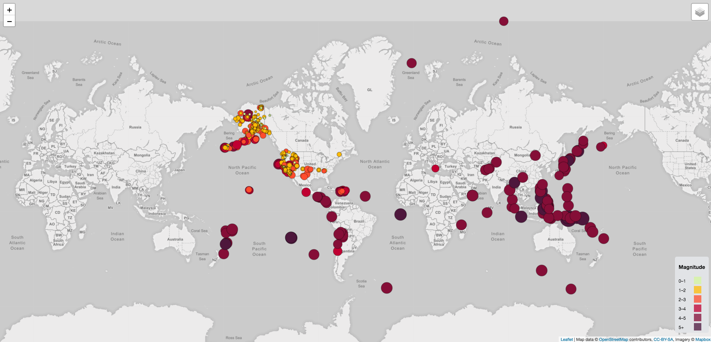
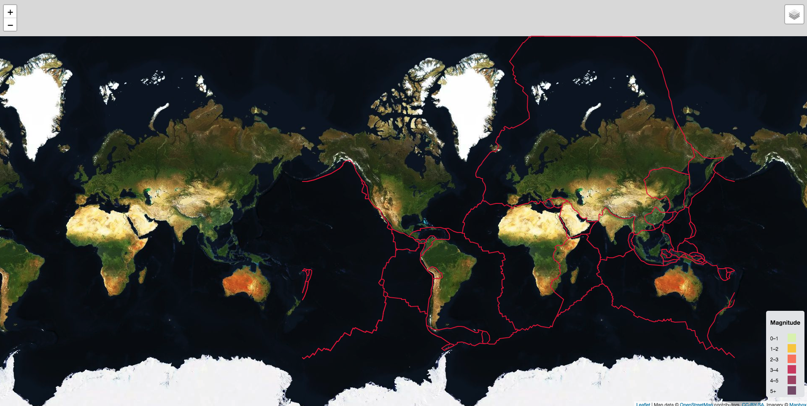
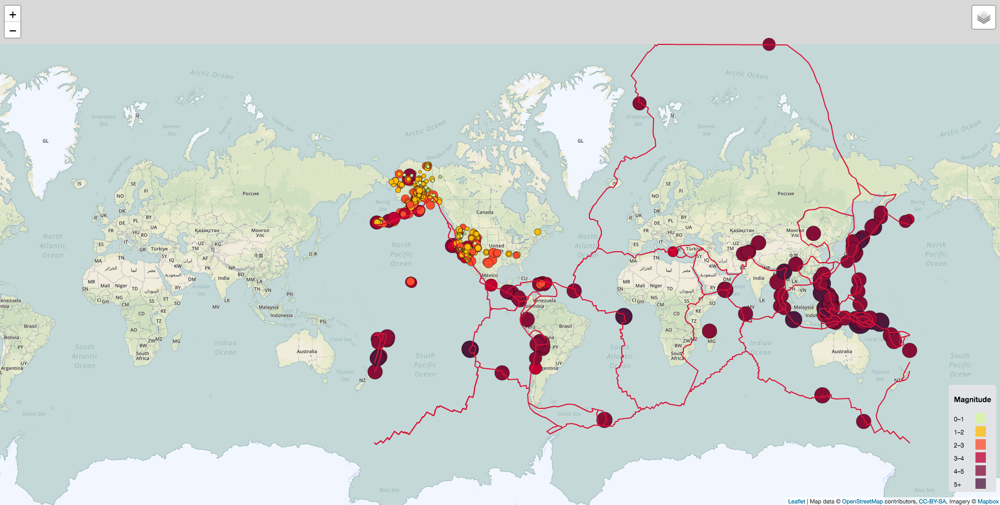

# Visualizing-Data-with-Leaflet

https://bigbluey.github.io/Visualizing-Data-with-Leaflet/

## Background

United States Geological Survey, or USGS, is responsible for providing scientific data about natural hazards, the health of our ecosystems and environment; and the impacts of climate and land-use change. Their scientists develop new methods and tools to supply timely, relevant, and useful information about the Earth and its processes.

Build a new set of tools that will allow the USGS to visualize their earthquake data. The USGS collects a massive amount of data from all over the world each day, but they lack a meaningful way of displaying it. Their hope is that being able to visualize their data will allow them to better educate the public and other government organizations (and hopefully secure more funding..) on issues facing our planet.

## Objectives

### Level 1: Basic Visualization

Visualize an earthquake data set

* Get the Data Set:

    * The USGS provides earthquake data in a number of different formats, updated every 5 minutes. Visit the [USGS GeoJSON Feed](http://earthquake.usgs.gov/earthquakes/feed/v1.0/geojson.php) page and pick a data set to visualize. When a data set is clicked on, for example 'All Earthquakes from the Past 7 Days', will be given a JSON representation of that data. Use the URL of this JSON to pull in the data for the visualization

* Import & Visualize the Data:

    * Create a map using Leaflet that plots all of the earthquakes from the data set based on their longitude and latitude
    * The data markers should reflect the magnitude of the earthquake in their size and color. Earthquakes with higher magnitudes should appear larger and darker in color
    * Include popups that provide additional information about the earthquake when a marker is clicked
    * Create a legend that will provide context for the map data

### Level 2: More Data

The USGS wants to plot a second data set on the map to illustrate the relationship between tectonic plates and seismic activity. Pull in a second data set and visualize it along side the original set of data. Data on tectonic plates can be found at <https://github.com/fraxen/tectonicplates>

* Plot a second data set on the map
* Add a number of base maps to choose from as well as separate out the two different data sets into overlays that can be turned on and off independently
* Add layer controls to the map

